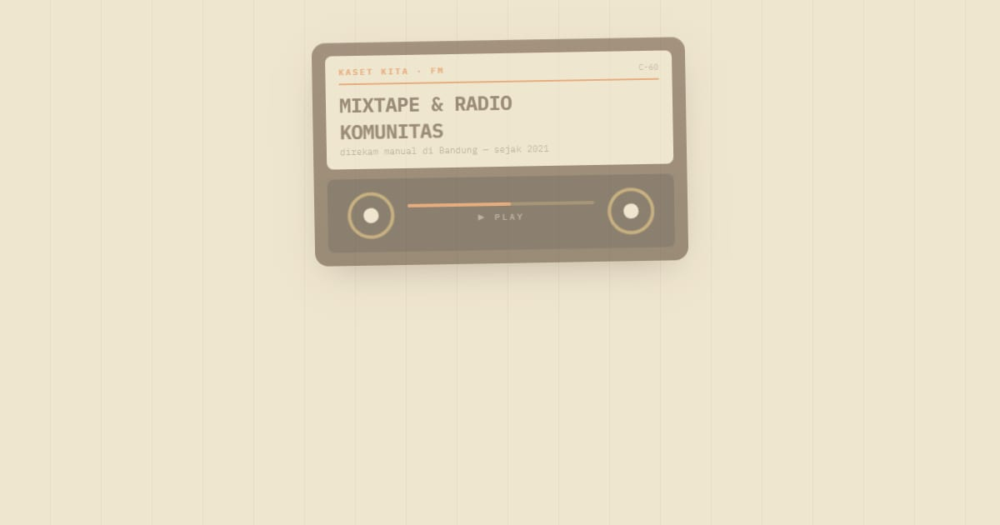

# Kaset Kita FM — Mixtape & Radio Komunitas, Bandung

Tautan Kaset Kita FM, radio komunitas di Bandung: siaran berikutnya dihitung menurut WIB, jadwal mingguan, arsip mixtape dengan tracklist band lokal, kirim demo, dan jadi penyiar tamu.

**Demo live:** https://linkinbio-kaset.vercel.app



> Template link-in-bio dengan persona fiktif. Akun, klien, harga, dan jadwal hanya contoh; tautan utama menuju halaman dalam yang benar-benar ada, dan formulir tidak mengirim data.

## Konsep

Persona Kaset Kita FM, radio kolektif. Mixtape kaset dengan dua gulungan yang berputar dan tautan yang dibagi ke Sisi A dan Sisi B.

## Halaman

- `/` — kaset C-60 dengan dua gulungan berputar dan status siaran berikutnya, tautan Side A/B
- `/siaran` — siaran berikutnya (WIB), jadwal tiga acara mingguan, formulir penyiar tamu
- `/mixtape` — arsip empat mixtape bertracklist (details), formulir kirim demo

## Teknologi

- Next.js 15.5 (App Router) dan React 19
- Tailwind CSS v4
- JavaScript
- Framer Motion, Lucide (ikon)
- Font: IBM Plex Mono (next/font)
- SEO: metadata per halaman, Open Graph, JSON-LD, sitemap.xml, dan robots.txt

## Menjalankan secara lokal

```bash
npm install
npm run dev
```

Buka http://localhost:3000. Untuk build produksi: `npm run build` lalu `npm start`.

---

Bagian dari koleksi 12 template link-in-bio di [PortalBio](https://www.pintuweb.com/link-in-bio). Dibuat oleh [PintuWeb](https://www.pintuweb.com), jasa pembuatan website.
